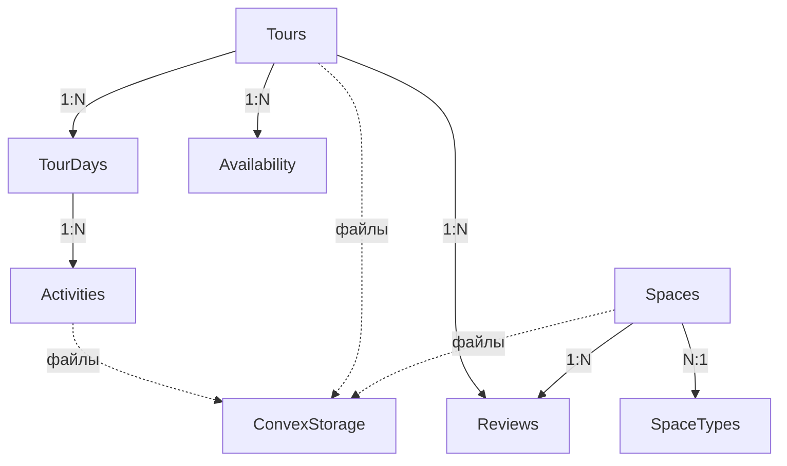

# 🗄️ База данных Park Hotel

*Последнее обновление: 14 июля 2025*

## 📊 Обзор

Проект использует **Convex DB** - современную serverless базу данных с реактивными обновлениями и строгой типизацией. Миграция с Supabase была выполнена в январе 2025 для получения преимуществ real-time функциональности и type-safety.

## 🏗️ Архитектура БД

### Основные принципы
1. **Минимальная избыточность** - храним только то, что нельзя вычислить
2. **Строгая типизация** - все поля имеют точные типы через Convex схему
3. **Реактивность** - изменения мгновенно отражаются на frontend
4. **Индексы для производительности** - оптимизированные запросы

## 📋 Схема таблиц

### 🏨 `spaces` - Номера отеля
```typescript
{
  // Основная информация
  name: string,                    // Название номера
  description: string,             // Описание
  capacity: number,                // Вместимость (человек)
  area_sqm: float64,               // Площадь в м²
  floor?: number,                  // Этаж (опционально)
  
  // Категория номера
  room_type: string,               // Старый формат: "hotel_room", "bungalow" и т.д.
  room_type_id?: Id<"space_types">, // Новый формат: связь с таблицей категорий
  
  // Удобства
  amenities: string[],             // Массив удобств: ["Wi-Fi", "Кондиционер", ...]
  
  // Цены
  price_per_night?: float64,       // Цена за ночь
  discount_percent?: float64,      // Процент скидки (0-100)
  hourly_rate?: float64,           // Почасовая оплата
  
  // Медиа
  images: string[],                // Массив ID файлов в Convex Storage
  
  // Статус и метаданные
  is_available: boolean,           // Доступность для бронирования
  original_id?: string,            // ID из старой системы (для миграции)
  created_at: number,              // Timestamp создания
  updated_at: number               // Timestamp обновления
}

// Индексы
.index("by_type", ["room_type"])
.index("by_availability", ["is_available"])
.index("by_original_id", ["original_id"])
```

### 🏷️ `space_types` - Категории номеров
```typescript
{
  type_id: number,           // Числовой ID (1-5) для обратной совместимости
  name: string,              // Полное название: "Номера в отеле"
  slug: string,              // Идентификатор: "hotel_room"
  display_name?: string,     // Отображаемое название: "Номер в отеле"
  order_index?: number,      // Порядок сортировки для drag&drop
  is_active?: boolean,       // Активность категории
  created_at: number,
  updated_at: number
}

// Индексы  
.index("by_type_id", ["type_id"])
.index("by_slug", ["slug"])
```

### 🎿 `tours` - Туры
```typescript
{
  // Основная информация
  title: string,
  description: string,
  region: string,                  // Регион проведения
  duration_days: number,           // Длительность в днях
  
  // Цены
  price: float64,                  // Базовая цена
  discount_percent?: float64,      // Скидка в процентах
  
  // Параметры
  max_participants: number,        // Максимум участников
  difficulty_level: string,        // Уровень сложности
  
  // Услуги
  included_services: string[],     // Что включено в стоимость
  excluded_services: string[],     // Что НЕ включено
  extra_services?: {               // Дополнительные услуги
    name: string,
    price: float64
  }[],
  
  // Медиа
  main_image?: string,             // Главное изображение (storageId)
  gallery_images: string[],        // Галерея (массив storageId)
  
  // Статус
  is_active: boolean,              // Активность тура
  visible?: boolean,               // Видимость на сайте
  created_at: number,
  updated_at: number
}

// Индексы
.index("by_region", ["region"])
.index("by_active", ["is_active"])
```

### 📅 `tour_days` - Дни туров
```typescript
{
  tour_id: Id<"tours">,            // Связь с туром
  day_number: number,              // Номер дня (1, 2, 3...)
  accommodation?: string,          // Где ночуем
  auto_distance_km?: number,       // Расстояние на авто
  walk_distance_km?: number,       // Пешее расстояние
  created_at: number,
  updated_at: number
}

// Индексы
.index("by_tour", ["tour_id"])
.index("by_tour_day", ["tour_id", "day_number"])
```

### 🏔️ `activities` - Активности в турах
```typescript
{
  tour_day_id: Id<"tour_days">,    // Связь с днем тура
  name: string,                    // Название активности
  description: string,             // Описание
  image?: string,                  // Изображение (storageId)
  image_url?: string,              // Внешний URL (альтернатива)
  type: string,                    // Тип: экскурсия, трансфер, питание...
  time_start?: string,             // Время начала "09:00"
  time_end?: string,               // Время окончания "14:00"
  price?: float64,                 // Цена если не включена
  order_number: number,            // Порядок в расписании дня
  is_included: boolean,            // Включена в стоимость тура
  created_at: number,
  updated_at: number
}

// Индексы
.index("by_tour_day", ["tour_day_id"])
.index("by_order", ["tour_day_id", "order_number"])
```

### 📆 `availability` - Доступность туров
```typescript
{
  tour_id: Id<"tours">,            // Связь с туром
  start_date: number,              // Дата заезда (timestamp)
  occupied_spots: number,          // Занято мест
  created_at: number,
  updated_at: number
}

// Вычисляемые поля (не хранятся в БД):
// - end_date = start_date + tour.duration_days
// - available_spots = tour.max_participants - occupied_spots
// - is_available = occupied_spots < tour.max_participants

// Индексы
.index("by_tour", ["tour_id"])
.index("by_start_date", ["start_date"])
.index("by_tour_date", ["tour_id", "start_date"])
```

### ⭐ `reviews` - Отзывы
```typescript
{
  tour_id?: Id<"tours">,           // Отзыв о туре
  space_id?: Id<"spaces">,         // Отзыв о номере
  booking_id?: string,             // Связь с бронированием (legacy)
  author_name: string,             // Имя автора
  rating: number,                  // Рейтинг 1-5
  comment: string,                 // Текст отзыва
  images?: string[],               // Фотографии
  is_published: boolean,           // Опубликован ли
  created_at: number
}

// Индексы
.index("by_tour", ["tour_id"])
.index("by_space", ["space_id"])
.index("by_published", ["is_published"])
.index("by_rating", ["rating"])
```

## 🔄 Связи между таблицами



## 🚀 API функции

### Spaces (номера)
- `getAllSpaces` - получить все номера с фильтрацией
- `getSpaceById` - получить номер по ID
- `createSpace` - создать номер
- `updateSpace` - обновить номер
- `deleteSpace` - удалить номер
- `getRoomTypes` - получить типы номеров (legacy)

### SpaceTypes (категории)
- `getAllSpaceTypes` - все категории с сортировкой
- `getSpaceTypeById` - категория по ID
- `createSpaceType` - создать категорию
- `updateSpaceType` - обновить категорию
- `updateSpaceTypesOrder` - изменить порядок (drag&drop)
- `deleteSpaceType` - удалить категорию
- `initializeDefaultCategories` - инициализация при первом запуске

### Tours (туры)
- `getAllTours` - все туры с фильтрацией
- `getTourById` - тур по ID с полной информацией
- `getTourWithDetails` - тур с днями и активностями
- `createTour` - создать тур
- `updateTour` - обновить тур
- `deleteTour` - удалить тур

### Availability (доступность)
- `getTourAvailability` - даты заездов для тура
- `createTourDate` - добавить дату заезда
- `updateTourOccupancy` - изменить занятость
- `deleteTourDate` - удалить дату

### Reviews (отзывы)
- `getReviewsForTour` - отзывы о туре
- `getReviewsForSpace` - отзывы о номере
- `createReview` - создать отзыв
- `updateReview` - обновить отзыв
- `deleteReview` - удалить отзыв

## 🔒 Безопасность

1. **Валидация на уровне схемы** - Convex автоматически проверяет типы
2. **Проверка прав доступа** - в каждой mutation проверяются права
3. **Защита от SQL инъекций** - невозможны в Convex
4. **Автоматическое экранирование** - все данные безопасны

## 📈 Оптимизация

### Индексы
Все часто используемые запросы оптимизированы индексами:
- Поиск по категории номера
- Фильтрация по доступности
- Сортировка по дате создания
- Связи между таблицами

### Вычисляемые поля
Не храним избыточные данные:
- Дата выезда = дата заезда + длительность
- Свободные места = максимум - занято
- URL изображений генерируются динамически

### Пагинация
Для больших списков используется пагинация:
```typescript
const spaces = await ctx.db
  .query("spaces")
  .paginate(args.paginationOpts)
```

## 🔄 Миграции

### Миграция с Supabase (январь 2025)
1. Экспорт данных из Supabase в JSON
2. Трансформация структуры под Convex схему
3. Импорт через seed функции
4. Валидация целостности данных

### Добавление категорий (июль 2025)
1. Создание таблицы `space_types`
2. Миграция статичных категорий в БД
3. Добавление `room_type_id` в spaces
4. Обратная совместимость через `room_type`

## 📚 Best Practices

1. **Используйте типизированные ID**
   ```typescript
   tour_id: Id<"tours"> // не string!
   ```

2. **Всегда добавляйте индексы для частых запросов**
   ```typescript
   .index("by_tour_date", ["tour_id", "start_date"])
   ```

3. **Валидируйте данные в mutations**
   ```typescript
   if (args.price < 0) {
     throw new Error("Цена не может быть отрицательной")
   }
   ```

4. **Используйте транзакции для связанных операций**
   ```typescript
   // Все операции в одной mutation = транзакция
   await ctx.db.insert("tours", tourData)
   await ctx.db.insert("tour_days", daysData)
   ```

---

*Документация актуальна на 14.07.2025*