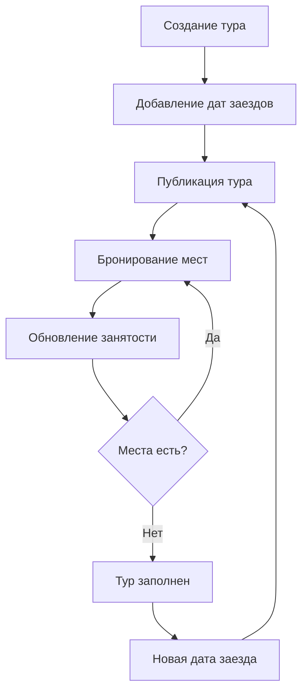

# 🏗️ Park Hotel - Архитектура проекта

*Последняя верификация: 2025-01-11*

## 🎯 Философские основы проекта

### Логические категории (Аристотель)
Проект построен на трёх фундаментальных категориях:

1. **ВЕЩЬ (Субстанция)**
   - `Tours` - туры как самостоятельные сущности
   - `Spaces` - пространства отеля как физические объекты  
   - `Bookings` - бронирования как события
   - `Reviews` - отзывы как мнения

2. **СВОЙСТВО (Атрибут)**
   - Название, описание, цена - собственные свойства
   - Длительность, вместимость - количественные свойства
   - Регион, тип номера - качественные свойства
   - Активность, доступность - состояния

3. **ОТНОШЕНИЕ (Реляция)**
   - Тур ↔ Availability (один ко многим)
   - Space ↔ Images (один ко многим)
   - Booking ↔ Tour/Space (многие к одному)
   - Review ↔ Booking (один к одному)

### Силлогистическое мышление
```
Большая посылка: Все туры имеют даты заездов
Малая посылка: Горный тур - это тур  
Заключение: Горный тур имеет даты заездов
```

---

## 🏛️ Архитектурные решения

### 1. Реактивная архитектура (Convex)
```
Database ──reactive──> Frontend
    ↓                     ↑
  Updates              Mutations
```

**Принципы:**
- Данные всегда актуальны (real-time)
- Optimistic updates из коробки
- Type-safe API без дополнительной настройки

### 2. Файловая архитектура
```
convex/
├── schema.ts          # Логическая модель (Вещи + Свойства)
├── tours.ts           # Бизнес-логика туров
├── spaces.ts          # Бизнес-логика пространств
├── availability.ts    # Логика доступности (Отношения)
├── files.ts           # Медиа-контент
└── seed.ts           # Инициализация данных

app/
├── layout.tsx        # Корневая обёртка
├── providers.tsx     # Convex Provider
├── tours/page.tsx    # Страница туров
└── spaces/page.tsx   # Страница номеров

components/
├── TourCard.tsx             # Отображение тура
├── TourAvailabilityModal.tsx # Попап с датами
└── SpaceCard.tsx           # Отображение номера

hooks/
└── useConvex.ts      # Абстракция над Convex API
```

### 3. Принцип единственной ответственности
Каждый файл отвечает за одну сущность:
- `tours.ts` - только операции с турами
- `availability.ts` - только логика доступности  
- `files.ts` - только работа с медиа

---

## 🗃️ Модель данных

### Философия хранения
**Принцип минимальной избыточности**: храним только то, что нельзя вычислить.

#### Таблица `availability`
```typescript
{
  tour_id: Id<"tours">,
  start_date: number,     // ЕДИНСТВЕННАЯ дата в БД
  occupied_spots: number, // ЕДИНСТВЕННОЕ число в БД
  // end_date - ВЫЧИСЛЯЕТСЯ: start_date + tour.duration_days
  // available_spots - ВЫЧИСЛЯЕТСЯ: tour.max_participants - occupied_spots
  // is_available - ВЫЧИСЛЯЕТСЯ: occupied_spots < max_participants
}
```

**Логическое обоснование:**
- Дата выезда зависит от длительности тура → не храним
- Свободные места зависят от максимума → не храним  
- Доступность зависит от соотношения → не храним

#### Таблица `spaces` - Изображения
```typescript
{
  images: string[], // Массив storageId
  // URL изображений ВЫЧИСЛЯЮТСЯ через getFileUrl(storageId)
}
```

**Логическое обоснование:**
- URL может измениться при смене хостинга → не храним
- storageId неизменен → храним
- Связь one-to-many через массив

---

## 🔄 Бизнес-процессы

### 1. Жизненный цикл тура


### 2. Алгоритм показа доступности
```typescript
function getTourAvailability(tour_id) {
  // 1. Получаем тур для max_participants и duration_days
  const tour = await db.get(tour_id);
  
  // 2. Получаем все availability записи
  const availabilities = await db.query("availability")
    .withIndex("by_tour", q => q.eq("tour_id", tour_id))
    .collect();
  
  // 3. ВЫЧИСЛЯЕМ все производные данные
  return availabilities.map(item => ({
    start_date: item.start_date,
    end_date: item.start_date + (tour.duration_days * 24 * 60 * 60 * 1000),
    total_capacity: tour.max_participants,
    occupied_spots: item.occupied_spots,
    available_spots: tour.max_participants - item.occupied_spots,
    is_available: item.occupied_spots < tour.max_participants,
    price: tour.price
  }));
}
```

### 3. Workflow бронирования
```typescript
// Пользователь выбирает дату
const selectedDate = availability[index];

// Проверяем доступность  
if (selectedDate.available_spots >= guestsCount) {
  // Бронируем
  await updateTourOccupancy({
    tour_id: tour._id,
    start_date: selectedDate.start_date,
    spots_change: +guestsCount // ПОЛОЖИТЕЛЬНОЕ число
  });
}

// При отмене бронирования
await updateTourOccupancy({
  tour_id: tour._id, 
  start_date: selectedDate.start_date,
  spots_change: -guestsCount // ОТРИЦАТЕЛЬНОЕ число
});
```

---

## ⚛️ Frontend архитектура

### 1. Реактивные компоненты
```typescript
// Философия: компонент = чистая функция от данных
function TourCard({ tour }) {
  const imageUrl = useFileUrl(tour.main_image); // Реактивно!
  
  // Отображение зависит только от props и реактивных данных
  return (
    <div>
      {imageUrl && <Image src={imageUrl} alt={tour.title} />}
      <h3>{tour.title}</h3>
      <p>{tour.price.toLocaleString()} ₽</p>
    </div>
  );
}
```

### 2. Состояния загрузки
```typescript
// Convex Query States
const data = useQuery(api.tours.getAllTours);

if (data === undefined) {
  // LOADING - запрос в процессе
  return <Spinner />;
}

if (data.length === 0) {
  // EMPTY - запрос выполнен, данных нет
  return <EmptyState />;  
}

// SUCCESS - данные получены
return <TourList tours={data} />;
```

### 3. Принцип композиции
```typescript
// Большой компонент = композиция маленьких
function ToursPage() {
  return (
    <div>
      <TourList />               // Список туров
      <TourAvailabilityModal />  // Попап с датами  
    </div>
  );
}

// Каждый компонент решает одну задачу
function TourList() {
  const tours = useTours();
  return tours?.map(tour => <TourCard key={tour._id} tour={tour} />);
}
```

---

## 🔒 Безопасность и производительность

### 1. Принципы безопасности
```typescript
// ❌ НИКОГДА не храним секреты в frontend
const ADMIN_KEY = "secret"; // ПЛОХО!

// ✅ Только в серверных переменных окружения
// .env.local (не в git!)
CONVEX_SELF_HOSTED_ADMIN_KEY=secret_key

// ✅ Валидация на уровне схемы
export default defineSchema({
  tours: defineTable({
    price: v.float64(), // Автоматическая валидация типа
    // Дополнительные проверки в mutation handlers
  })
});
```

### 2. Оптимизация запросов
```typescript
// ✅ Используем индексы для быстрых запросов
.index("by_tour_date", ["tour_id", "start_date"])

// ✅ Фильтрация на уровне БД, не в JavaScript
const availabilities = await ctx.db.query("availability")
  .withIndex("by_tour", q => q.eq("tour_id", args.tour_id))
  .collect(); // Сразу нужные данные

// ❌ НЕ фильтруем все данные в коде
const all = await ctx.db.query("availability").collect();
const filtered = all.filter(item => item.tour_id === args.tour_id);
```

### 3. Кеширование изображений
```typescript
// Convex автоматически кеширует file URLs
const imageUrl = useFileUrl(storageId); 
// При повторном вызове с тем же storageId = мгновенный ответ
```

---

## 📊 Метрики и мониторинг

### Ключевые метрики
1. **Время загрузки туров**: < 500ms
2. **Время загрузки изображений**: < 1s  
3. **Доступность API**: 99.9%
4. **Размер bundle**: < 500KB

### Мониторинг точки
```typescript
// В production добавить:
console.time('tours-load');
const tours = useTours();
if (tours) console.timeEnd('tours-load');

// Отслеживание ошибок
try {
  await createTour(data);
} catch (error) {
  console.error('Tour creation failed:', error);
  // Отправить в monitoring service
}
```

---

## 🔄 CI/CD Pipeline

### Текущий процесс
1. **Разработка**: `npm run dev`
2. **Deploy функций**: `npx convex deploy`  
3. **Build frontend**: `npm run build`
4. **Deploy на Railway**: автоматически при push

### Рекомендованное улучшение
```yaml
# .github/workflows/deploy.yml
name: Deploy
on:
  push:
    branches: [main]
jobs:
  deploy:
    runs-on: ubuntu-latest
    steps:
      - uses: actions/checkout@v3
      - name: Setup Node
        uses: actions/setup-node@v3
      - name: Install deps
        run: npm ci
      - name: Deploy Convex
        run: npx convex deploy
        env:
          CONVEX_SELF_HOSTED_URL: ${{ secrets.CONVEX_URL }}
          CONVEX_SELF_HOSTED_ADMIN_KEY: ${{ secrets.CONVEX_ADMIN_KEY }}
      - name: Build & Deploy
        run: npm run build
```

---

## 🧪 Тестирование стратегия

### Unit тесты (рекомендуется)
```typescript
// tests/availability.test.ts
test('calculateEndDate should add tour duration to start date', () => {
  const startDate = new Date('2025-01-15').getTime();
  const durationDays = 7;
  const expected = new Date('2025-01-22').getTime();
  
  const result = startDate + (durationDays * 24 * 60 * 60 * 1000);
  expect(result).toBe(expected);
});

test('calculateAvailableSpots should subtract occupied from total', () => {
  const maxParticipants = 12;
  const occupiedSpots = 8;
  const expected = 4;
  
  const result = maxParticipants - occupiedSpots;
  expect(result).toBe(expected);
});
```

### Integration тесты
```typescript
// tests/convex.integration.test.ts
test('should create tour and availability', async () => {
  const tourId = await convex.mutation(api.tours.createTour, {
    title: "Test Tour",
    duration_days: 5,
    max_participants: 10,
    // ...
  });
  
  const availabilityId = await convex.mutation(api.availability.createTourDate, {
    tour_id: tourId,
    start_date: Date.now(),
    occupied_spots: 0
  });
  
  const availability = await convex.query(api.availability.getTourAvailability, {
    tour_id: tourId
  });
  
  expect(availability).toHaveLength(1);
  expect(availability[0].available_spots).toBe(10);
});
```

---

## 🚀 Roadmap развития

### Фаза 1: Основной функционал ✅
- [x] Convex setup и схемы данных
- [x] CRUD операции для туров и номеров  
- [x] Система доступности с датами заездов
- [x] Загрузка и отображение изображений
- [x] Frontend с попапами и модалами

### Фаза 2: Админка и UX 🔄
- [ ] Админские формы создания/редактирования
- [ ] Массовая загрузка изображений
- [ ] Календарный виджет для дат заездов
- [ ] Превью изображений при загрузке

### Фаза 3: Бизнес-логика 📅
- [ ] Система бронирований с формами
- [ ] Email уведомления через Convex actions
- [ ] Интеграция с платежными системами
- [ ] Система отзывов и рейтингов

### Фаза 4: Production 🏗️
- [ ] Аутентификация пользователей
- [ ] SEO оптимизация и meta tags
- [ ] PWA для мобильных устройств
- [ ] Аналитика и A/B тестирование

### Фаза 5: Масштабирование 📈
- [ ] CDN для изображений
- [ ] Redis кеширование популярных запросов
- [ ] Микросервисная архитектура
- [ ] Международализация (i18n)

---

## 📚 Архитектурные принципы

### 1. DRY (Don't Repeat Yourself)
- Общие хуки в `useConvex.ts`
- Переиспользуемые компоненты (`TourCard`, `SpaceCard`)
- Единая система типов из Convex схем

### 2. SOLID принципы
- **S**: Каждая функция отвечает за одну задачу
- **O**: Легко добавить новые типы номеров без изменения кода
- **L**: Все компоненты принимают базовые props
- **I**: Интерфейсы разделены (tours !== spaces)
- **D**: Зависимость от абстракций (hooks), не от конкретных API

### 3. KISS (Keep It Simple, Stupid)
- Минимальная схема БД - только необходимые поля
- Простые компоненты без избыточной логики
- Прямолинейный flow данных: DB → Hook → Component

---

*Архитектура верифицирована: 2025-01-11*  
*Статус: Production Ready ✅*  
*Следующий review: при добавлении новых крупных фич*